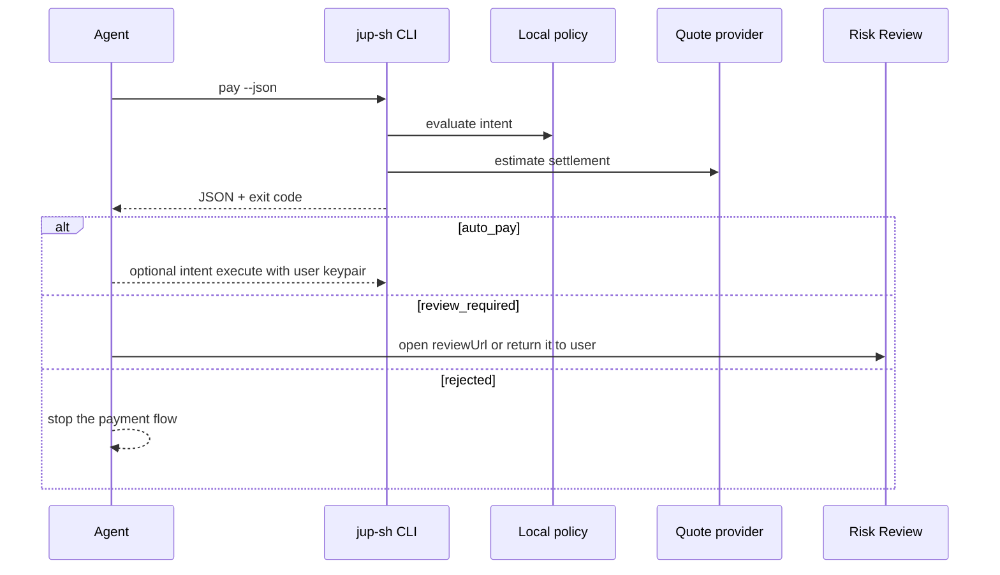

# Agent Integration

This guide describes the current safe integration pattern for agents and
scripts.

`jup.sh` creates local payment intents, evaluates local policy, gets Jupiter
settlement quotes, and returns a structured result. It can execute a real swap
from the user's machine when the user explicitly provides a local Solana
keypair.

## Integration Model



The agent should not handle private keys itself. The CLI is the policy and
settlement layer; execution requires an explicit user-owned local keypair.

## 1. Initialize A Local Workspace

```bash
npx jup-sh init
```

This writes:

```txt
jup.config.json
jup.policy.json
```

`jup.config.json` contains local defaults:

```json
{
  "reviewBaseUrl": "https://www.jup.sh",
  "policyPath": "jup.policy.json",
  "intentStore": ".jup-sh/intents",
  "quoteProvider": "mock"
}
```

`jup.policy.json` contains the risk controls:

```json
{
  "maxAutoSettleUSDC": 5,
  "maxAllowedSettleUSDC": 100,
  "maxPriceImpactBps": 100,
  "reviewHighPriceImpact": true,
  "verifiedTokens": ["USDC", "SOL", "JUP", "BONK"],
  "trustedRecipients": [],
  "reviewUnknownRecipients": true
}
```

Use `--force` only when you intentionally want to overwrite local files.

Check the local workspace:

```bash
npx jup-sh doctor
```

Agents and scripts can use:

```bash
npx jup-sh doctor --json
```

## 2. Call `pay --json`

Agents should use JSON mode and branch on the process exit code:

```bash
npx jup-sh pay --agent deepseek --token SOL --amount 20 --settle USDC --json
```

Exit codes:

| Exit code | Decision | Agent behavior |
| --- | --- | --- |
| `0` | `auto_pay` | Intent is inside policy and ready for future local authorization. |
| `2` | `review_required` | Return or open `reviewUrl`. This is a controlled outcome. |
| `1` | `rejected` or command failure | Stop the payment flow. |

## 3. Tune Local Policy

The default policy is intentionally conservative. Unknown recipients and
amounts above the auto-pay limit require review.

Trust a known API or vendor recipient:

```bash
npx jup-sh policy trust api.vendor.example
```

Raise the auto-pay limit:

```bash
npx jup-sh policy set max-auto 10
```

Now a small payment to the trusted recipient can stay on the automatic path:

```bash
npx jup-sh pay \
  --agent deepseek \
  --token SOL \
  --amount 6 \
  --settle USDC \
  --recipient api.vendor.example \
  --json
```

This should return:

```json
{
  "decision": "auto_pay",
  "nextAction": "ready_for_authorization"
}
```

`auto_pay` means the intent is inside local policy and ready for authorization.
For CLI execution, call `intent execute` only after the user has provided the
local keypair path.

```bash
npx jup-sh intent execute intent_xxx \
  --keypair ~/.config/solana/id.json \
  --rpc-url https://api.mainnet-beta.solana.com \
  --json
```

## 4. Handle Review

When policy requires review, the JSON output includes:

```json
{
  "decision": "review_required",
  "nextAction": "open_review",
  "reviewUrl": "https://www.jup.sh/pay/intent_xxx#intent=...",
  "reviewCommand": "npx jup-sh review intent_xxx"
}
```

The agent should return that URL to the user or open it in the surrounding app.
It should not bypass policy. `reviewCommand` is available when the surrounding
tool wants to recreate the URL from the local intent store.

You can also recreate the full Risk Review URL from a saved intent:

```bash
npx jup-sh review intent_xxx
```

For agents, use JSON mode:

```bash
npx jup-sh review intent_xxx --json
```

This returns:

```json
{
  "intentId": "intent_xxx",
  "decision": "review_required",
  "nextAction": "open_review",
  "reviewUrl": "https://www.jup.sh/pay/intent_xxx#intent=...",
  "reviewCommand": "npx jup-sh review intent_xxx",
  "payload": "..."
}
```

To poll local lifecycle state without reading the full intent body:

```bash
npx jup-sh intent status intent_xxx --json
```

This returns the same status summary shape as the local read-only Intent API.

In local draft builds, a reviewed intent can be marked explicitly:

```bash
npx jup-sh intent approve intent_xxx --reviewer local --reason "known vendor" --json
npx jup-sh intent reject intent_xxx --reviewer local --reason "too risky" --json
```

Approval only changes local lifecycle state to `ready_for_authorization`. It
does not mean a transaction has been signed or sent.

Agents can inspect the future transaction request gate:

```bash
npx jup-sh intent preflight intent_xxx --json
```

In current draft builds, preflight is intentionally not a signable transaction.
It reports `transactionImplemented: false`.

Agents can also ask for receipt state:

```bash
npx jup-sh intent receipt intent_xxx --json
```

Until transaction submission and confirmation exist, this returns
`available: false` and `receipt: null`.

For local audit context, agents can read intent events:

```bash
npx jup-sh intent events intent_xxx --json
```

Events are useful for debugging and local handoff, but they are not a hosted
authenticated audit trail in the current alpha.

## 5. Export A Review Payload

Saved intents can be exported as a static Risk Review URL:

```bash
npx jup-sh intent export intent_xxx
```

`jup-sh review <intent_id>` is the preferred shortcut for this path. `intent
export` remains available for lower-level scripting.

The exported URL uses a fragment payload:

```txt
https://www.jup.sh/pay/intent_xxx#intent=<base64url-json-payload>
```

This lets a local CLI or SDK hand off review evidence without a jup.sh backend.

## Current Non-Goals

- No custody.
- No hosted private-key handling.
- No server-side signing.
- No remote backend persistence.
- No authentication.
