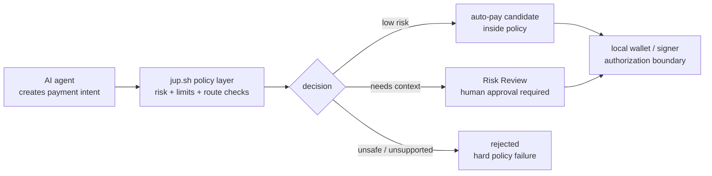
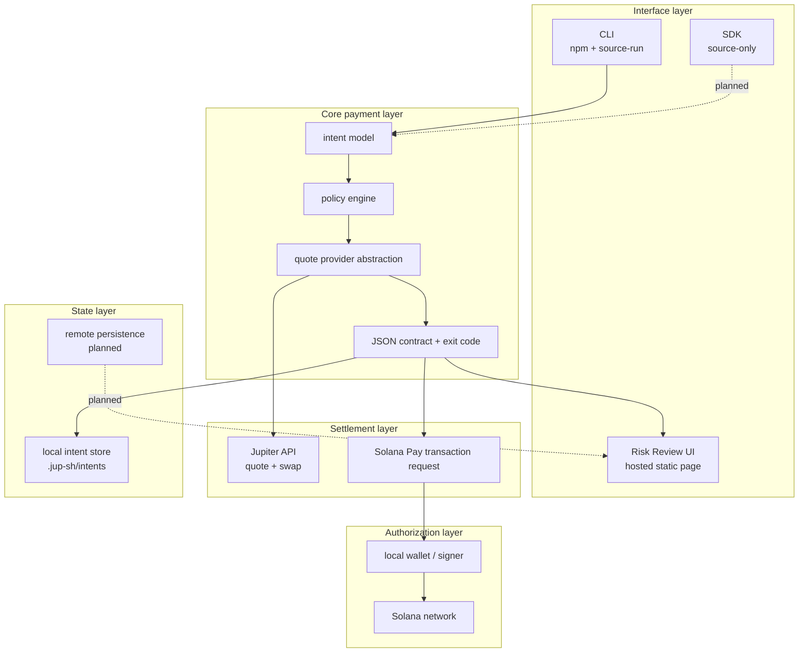
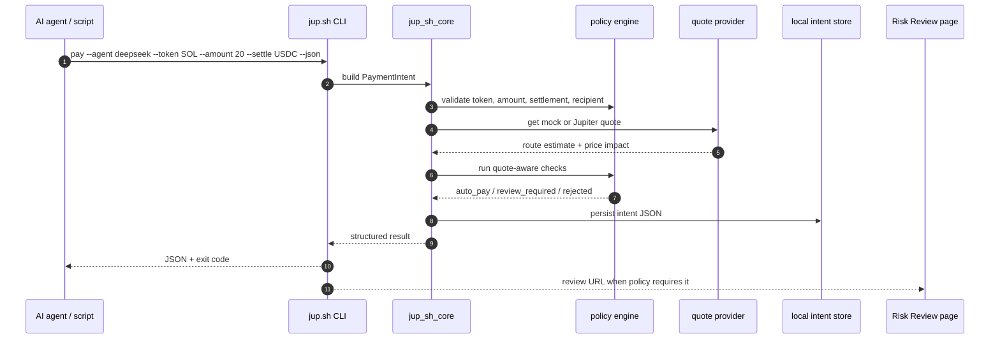
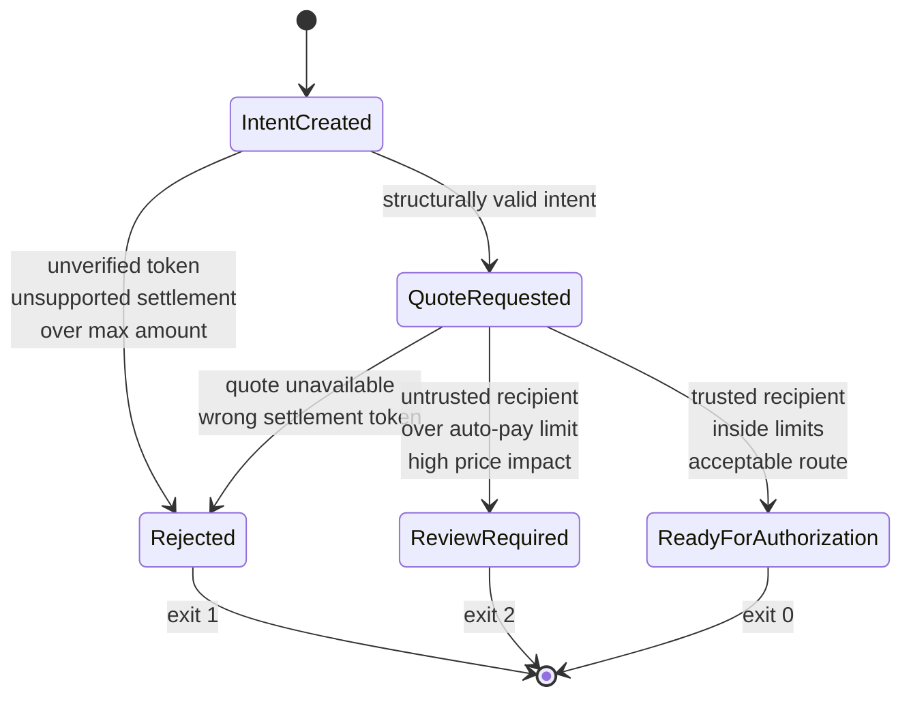
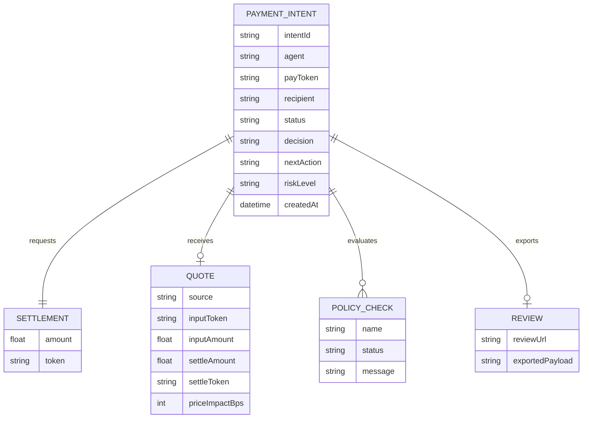
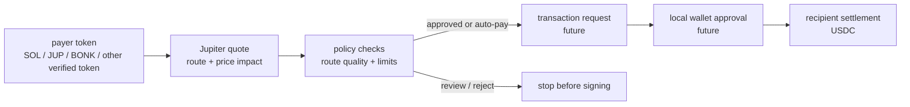
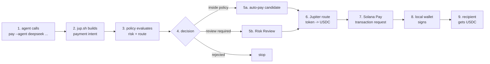

# Architecture

`jup.sh` is a risk and settlement layer for Solana agent payments.

The design goal is narrow: an agent can create a payment intent, but policy
decides whether that intent can continue automatically, must be reviewed by a
human, or should be rejected. Jupiter is used for token-to-USDC settlement. The
current 1.0 release can build Jupiter swap transactions and execute them from
the user's machine with an explicit local keypair.

## Product Boundary

The most important boundary is between **intent creation** and **funds
authorization**.

Agents can request a payment. They do not directly control private keys, sign
transactions, or bypass policy. The user or local wallet remains the signing
boundary.



This boundary keeps the product from becoming "an agent wallet." `jup.sh`
should be a payment control layer: it receives structured intent, adds policy
and settlement context, then returns a deterministic next action.

## Layered Architecture

The system is split into five layers. The current release implements the CLI,
core policy engine, quote abstraction, local intent store, static Risk Review
rendering, Solana Pay transaction requests, and local CLI execution.



This structure lets the CLI and SDK share the same core behavior. The interface
may change, but the policy result, JSON contract, and settlement assumptions
should remain stable.

## Current Runtime Flow

The CLI flow is local and available through `npx jup-sh`. It is useful
because it validates the contract an agent would actually consume: command
input, structured output, exit codes, policy checks, and a review URL when
needed.



The server transaction request path creates an unsigned Jupiter swap
transaction for wallet signing. The CLI execution path signs and submits only
when the user provides a local keypair.

## Policy Decision Model

Policy is not a single boolean. It should produce one of three decisions:

- `auto_pay`: intent is inside policy and can proceed to local authorization.
- `review_required`: intent is valid, but risk context requires a human.
- `rejected`: intent violates a hard rule and should not continue.



This is the core product hook. `jup.sh` becomes more valuable as the policy
layer gets richer: recipient trust, route quality, token verification,
behavioral limits, and eventually business-specific rules.

## Data Model

The current data model is intentionally small. It should remain explicit,
because agents and scripts need predictable fields.



The important design choice is that policy evidence is returned with the
decision. A caller should not receive only `review_required`; it should receive
the reasons and checks that made review necessary.

## Settlement Direction

Jupiter is the settlement primitive. The payer should be able to use any
verified token; the recipient should receive USDC.

The CLI can ask Jupiter for ExactOut route quotes and preserve that quote
response for transaction creation. The same route context is used to build a
Solana Pay transaction request or a local CLI execution transaction.

The wallet-facing boundary is documented in
[Transaction Request Skeleton Design](transaction-request-skeleton-design.md).

The local prototype server also exposes a read-only Intent API for status
inspection:

```txt
GET /api/intents
GET /api/intents/:intentId
GET /api/intents/:intentId/status
GET /api/intents/:intentId/events
GET /api/intents/:intentId/receipt
POST /api/intents/:intentId/review
GET /api/transaction-requests/:intentId
POST /api/transaction-requests/:intentId
GET /api/transaction-requests/:intentId/preflight
```

This API reads and updates the same local intent store as the CLI. Review
approval/rejection is local. Transaction request POST validates request shape,
intent readiness, request token, quote freshness, executable Jupiter quote
state, and recipient token account before returning a signable transaction.

Preflight exposes the same transaction request gate without asking a wallet to
POST an account first.

Receipt state is also explicit. Until the system observes a confirmed
settlement, `GET /api/intents/:intentId/receipt` returns an unavailable receipt
scaffold rather than claiming payment completion.

Intent events provide a local audit scaffold for review decisions and
transaction request attempts. They are designed to be replaced or backed by a
hosted authenticated event log in a production version.

Intent expiry is a replay-control scaffold. New local intents include
`expiresAt`; expired intents remain readable but cannot be approved or used for
transaction request creation.

Transaction request URLs also include a local opaque request token. The current
draft runtime rejects transaction request metadata and POST calls when the token
is missing or incorrect.

The transaction request POST gate also binds the first valid wallet account to
the local intent. Later attempts with a different account are rejected before
any future transaction construction can occur.

Quote freshness is a separate transaction-construction gate. Draft intents carry
quote capture and expiry metadata; stale quotes are blocked before transaction
request creation.



The settlement layer should never hide risk. Route quality, settlement token,
and price impact are policy inputs, not just execution details.

## Current Alpha Boundary

This table is deliberately strict. It keeps the project honest about what is
usable today and what is still design work.

| Area | Current alpha | Target direction |
| --- | --- | --- |
| CLI | Source-run Rust CLI | Published npm wrapper and stable CLI |
| Agent contract | JSON output and exit codes | SDK + CLI contract shared by agents |
| Policy | Deterministic local checks | Configurable policy profiles |
| Jupiter | Quote-only estimates | Transaction route construction |
| Transaction request | Draft skeleton only | Solana Pay request endpoint |
| Risk Review | Static hosted page | Review workflow with durable state |
| Signing | Not implemented | Local wallet/user approval boundary |
| Settlement | Not executed | USDC settlement through Solana transaction |
| Storage | Local `.jup-sh/intents` | Optional remote persistence |

## Future End-to-End Flow

The target flow should still feel simple from the agent side. Complexity belongs
inside `jup.sh`: policy, risk evidence, route checks, review fallback, and
transaction request construction.



The product should stay command-first. UI exists to review risk and explain
policy decisions, not to become another manual payment dashboard.

The transaction request step should follow the skeleton contract first, then
implementation can add server-side persistence, route construction, and wallet
handoff without changing the agent-facing intent model.

## Engineering Principles

- Keep the agent interface boring: stable commands, stable JSON, stable exit
  codes.
- Keep signing local: agents create intents; users or local policy authorize
  funds.
- Treat policy output as product surface: every review decision needs evidence.
- Treat Jupiter route data as risk context, not only settlement plumbing.
- Ship in phases: quote-only contract first, then transaction request, then
  carefully scoped execution.
