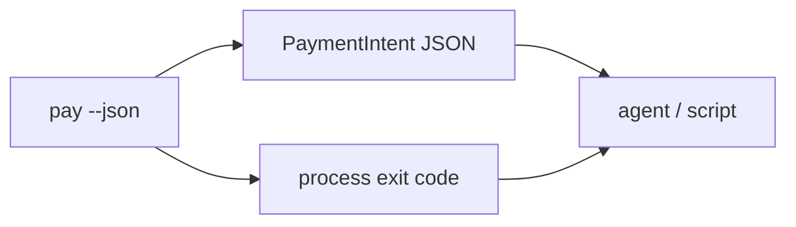

# CLI JSON Contract

This page defines the agent-facing contract for:

```bash
jup-sh pay --agent deepseek --token SOL --amount 20 --settle USDC --json
```

The contract is intentionally small. It represents a local payment intent and
policy result. It does not include private keys, signatures, unsigned
transactions, custody, or swap execution.

## Contract Shape



Agents should read both outputs:

- stdout contains the structured intent JSON;
- the process exit code tells the caller how to branch.

## Stdout And Stderr

When `--json` is set:

- stdout must contain exactly one JSON object;
- human-readable logs must not be mixed into stdout;
- command errors are written to stderr;
- exit code `2` is not a system failure. It means policy requires review.

This makes the CLI safe to call from scripts, local tools, and agent runtimes.

## Exit Codes

| Exit code | Decision | Meaning |
| --- | --- | --- |
| `0` | `auto_pay` | The intent is inside policy and ready for local authorization in a future phase. |
| `2` | `review_required` | The intent is valid, but policy requires Risk Review. |
| `1` | `rejected` or failure | The intent is rejected, invalid, or the command failed. |

## PaymentIntent

| Field | Type | Required | Description |
| --- | --- | --- | --- |
| `intentId` | string | yes | Local intent identifier. Current values start with `intent_`. |
| `agent` | string | yes | Agent name supplied by `--agent`. |
| `payToken` | string | yes | Normalized payer token symbol. |
| `recipient` | string or null | yes | Recipient address or local label, if supplied. |
| `reference` | string or null | yes | External reference or memo, if supplied. |
| `settlement` | object | yes | Requested settlement amount and token. |
| `quote` | object or null | yes | Settlement quote. Rejected pre-policy intents may have `null`. |
| `status` | string | yes | Lifecycle status derived from the policy decision. |
| `decision` | string | yes | Policy decision. |
| `nextAction` | string | yes | Next action for the agent or local user. |
| `riskLevel` | string | yes | Coarse risk level derived from policy. |
| `reasons` | string[] | yes | Human-readable review or rejection reasons. |
| `policyChecks` | object[] | yes | Deterministic policy evidence. |
| `reviewUrl` | string | yes | Hosted Risk Review URL for the intent. For `review_required`, this is a full URL with `#intent=` payload. |
| `reviewCommand` | string | yes | CLI shortcut that recreates the Risk Review URL from the local intent store. |
| `createdAt` | string | yes | RFC 3339 timestamp. |

## Nested Objects

### settlement

| Field | Type | Description |
| --- | --- | --- |
| `amount` | number | Requested settlement amount. |
| `token` | string | Settlement token. The alpha supports `USDC`. |

### quote

| Field | Type | Description |
| --- | --- | --- |
| `source` | string | Quote provider source, such as `mock_jupiter` or `jupiter_swap_exact_out`. |
| `inputToken` | string | Token the payer would spend. |
| `inputAmount` | number | Estimated payer token amount. |
| `settleAmount` | number | Requested settlement amount. |
| `settleToken` | string | Settlement token. |
| `priceImpactBps` | number | Price impact in basis points. |

### policyChecks[]

| Field | Type | Description |
| --- | --- | --- |
| `name` | string | Stable machine-readable check name. |
| `status` | string | `pass`, `review`, or `reject`. |
| `message` | string | Human-readable explanation. |

Current check names:

| Check | Purpose |
| --- | --- |
| `verified_token` | Payer token is in the verified token list. |
| `settlement_token` | Settlement token is supported. |
| `max_allowed_amount` | Amount is below the hard rejection limit. |
| `recipient_trust` | Recipient is trusted or unknown recipients are allowed. |
| `auto_pay_limit` | Amount is below the auto-pay threshold. |
| `quote_available` | Quote provider returned a usable quote. |
| `quote_settlement_token` | Quote still settles to the requested settlement token. |
| `quote_price_impact` | Price impact is acceptable or requires review. |

## Enums

### status

| Value | Meaning |
| --- | --- |
| `ready_for_authorization` | Policy passed. A future phase may continue to local authorization. |
| `review_required` | Intent is valid, but must be reviewed before signing. |
| `rejected` | Intent should not continue. |

### decision

| Value | Meaning |
| --- | --- |
| `auto_pay` | Intent is inside policy. |
| `review_required` | Intent needs human review. |
| `rejected` | Intent violates hard policy. |

### nextAction

| Value | Meaning |
| --- | --- |
| `ready_for_authorization` | Continue to local authorization in a future phase. |
| `open_review` | Open or return `reviewUrl`. |
| `rejected` | Stop the flow. |

### riskLevel

| Value | Meaning |
| --- | --- |
| `low` | Policy passed. |
| `medium` | Review is required. |
| `high` | Intent is rejected. |

## Example: Review Required

```json
{
  "intentId": "intent_abc123",
  "agent": "deepseek",
  "payToken": "SOL",
  "recipient": null,
  "reference": null,
  "settlement": {
    "amount": 20,
    "token": "USDC"
  },
  "quote": {
    "source": "mock_jupiter",
    "inputToken": "SOL",
    "inputAmount": 0.13333333,
    "settleAmount": 20,
    "settleToken": "USDC",
    "priceImpactBps": 12
  },
  "status": "review_required",
  "decision": "review_required",
  "nextAction": "open_review",
  "riskLevel": "medium",
  "reasons": [
    "recipient is not trusted",
    "settlement amount exceeds auto-pay limit of 5 USDC"
  ],
  "policyChecks": [
    {
      "name": "verified_token",
      "status": "pass",
      "message": "SOL is verified"
    },
    {
      "name": "recipient_trust",
      "status": "review",
      "message": "recipient is not trusted"
    }
  ],
  "reviewUrl": "https://www.jup.sh/pay/intent_abc123#intent=...",
  "reviewCommand": "npx jup-sh@alpha review intent_abc123",
  "createdAt": "2026-05-09T00:00:00Z"
}
```

A full fixture is stored at:

```txt
tests/fixtures/pay-review-required.json
```

Runtime-specific fields include `intentId`, `reviewUrl`, `reviewCommand`, and
`createdAt`.

## Parser Guidance For Agents

Agents should:

1. Parse stdout as JSON only when `--json` is set.
2. Treat exit code `2` as a valid policy state.
3. Use `nextAction` for control flow.
4. For `open_review`, return or open `reviewUrl`; `reviewCommand` is available
   for local CLI handoff.
5. Show `reasons` and `policyChecks` when asking a user to review.
6. Never infer that `auto_pay` means a transaction has been signed. In the
   current alpha it only means the intent is ready for a future authorization
   step.
