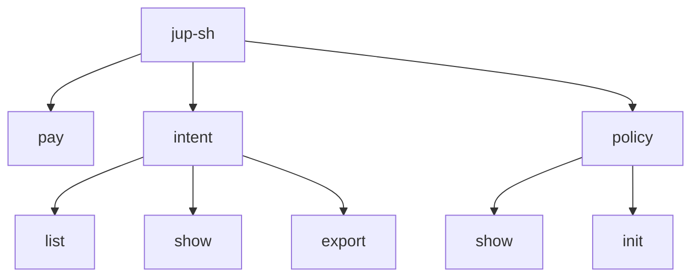
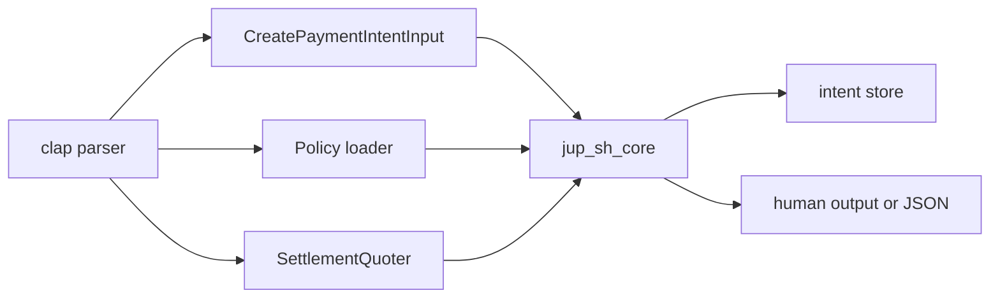
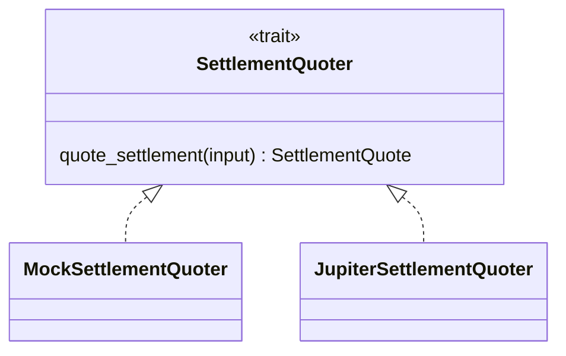
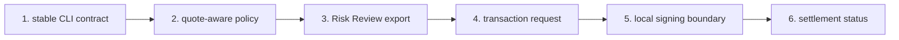

# CLI Technical Design

The CLI is the first real product surface for `jup.sh`.

The website explains the idea. The CLI validates whether an agent can create a
payment intent, receive a deterministic policy result, and hand off to Risk
Review when needed.

## Goal

Make this command meaningful:

```bash
jup-sh pay --agent deepseek --token SOL --amount 20 --settle USDC
```

The CLI should produce a structured local payment intent:

```txt
agent intent -> policy checks -> quote estimate -> final decision -> local record
```

It should not sign, submit, or execute a payment in the alpha.

## Command Surface



Primary command:

```bash
jup-sh pay --agent deepseek --token SOL --amount 20 --settle USDC
```

Important options:

| Option | Required | Description |
| --- | --- | --- |
| `--agent` | yes | Agent name, such as `deepseek`, `claude`, `qwen`, or `codex`. |
| `--token` | yes | Payer token symbol. |
| `--amount` | yes | Settlement amount. Preferred syntax is `--amount 20 --settle USDC`. |
| `--settle` | yes | Settlement token. The alpha supports `USDC`. |
| `--recipient` | no | Recipient address or local label. Unknown recipients trigger review by default. |
| `--reference` | no | External reference or memo. |
| `--json` | no | Print only the JSON contract. |
| `--quote-provider` | no | `mock` by default. Use `jupiter` for quote-only real routing. |
| `--jupiter-quote-url` | no | Defaults to Jupiter Swap quote API. |
| `--jupiter-api-key` | no | Optional API key. Defaults to `JUPITER_API_KEY` when set. |
| `--slippage-bps` | no | Slippage tolerance for Jupiter quotes. Defaults to `50`. |
| `--review-base-url` | no | Defaults to `https://jup.sh`. |
| `--policy` | no | Optional policy file. Defaults to `./jup.policy.json` when present. |
| `--store` | no | Intent storage directory. Defaults to `.jup-sh/intents`. |

The legacy form `--settle 20 USDC` is still accepted for compatibility, but new
examples should use `--amount 20 --settle USDC`.

## Runtime Architecture



The CLI owns parsing, storage, environment variables, and terminal behavior.
The core crate owns payment intent creation, policy evaluation, quote policy,
and output models.

## Rust Workspace

```txt
rust/
  Cargo.toml
  crates/
    core/
      src/lib.rs
    cli/
      src/main.rs
```

Responsibilities:

| Crate | Owns |
| --- | --- |
| `jup_sh_core` | Data models, policy evaluation, quote abstraction, intent creation. |
| `jup-sh-cli` | Commands, CLI args, policy file loading, intent persistence, output formatting. |

This split matters because a future SDK or backend should reuse the core crate
without inheriting CLI-specific behavior.

## Core API

The central core call is:

```rust
create_payment_intent_with_quoter(input, policy, review_base_url, quoter)
```

Inputs:

```rust
CreatePaymentIntentInput {
    agent: "deepseek".into(),
    pay_token: "SOL".into(),
    settle_amount: 20.0,
    settle_token: "USDC".into(),
    recipient: None,
    reference: None,
}
```

Output:

```rust
PaymentIntent {
    intent_id,
    agent,
    pay_token,
    recipient,
    reference,
    settlement,
    quote,
    status,
    decision,
    next_action,
    risk_level,
    reasons,
    policy_checks,
    review_url,
    created_at,
}
```

## Policy Evaluation

Policy is deterministic and local in the alpha.

Default shape:

```json
{
  "maxAutoSettleUSDC": 5,
  "maxAllowedSettleUSDC": 100,
  "maxPriceImpactBps": 100,
  "reviewHighPriceImpact": true,
  "verifiedTokens": ["USDC", "SOL", "JUP", "BONK"],
  "trustedRecipients": [],
  "reviewUnknownRecipients": true
}
```

Policy checks are returned as evidence:

```json
{
  "name": "recipient_trust",
  "status": "review",
  "message": "recipient is not trusted"
}
```

Decision mapping:

| Decision | Status | Next action | Exit code |
| --- | --- | --- | --- |
| `auto_pay` | `ready_for_authorization` | `ready_for_authorization` | `0` |
| `review_required` | `review_required` | `open_review` | `2` |
| `rejected` | `rejected` | `rejected` | `1` |

## Quote Boundary



The mock provider is the default for local development and tests.

Jupiter mode is quote-only:

```bash
jup-sh pay \
  --agent deepseek \
  --token SOL \
  --amount 20 \
  --settle USDC \
  --quote-provider jupiter
```

The quote is used by policy checks such as `quote_price_impact`. The alpha does
not request swap transaction payloads.

## Intent Storage

Local intents are stored as JSON files:

```txt
.jup-sh/intents/<intent_id>.json
```

Commands:

```bash
jup-sh intent list
jup-sh intent show intent_xxx
jup-sh intent export intent_xxx
```

Export turns the saved local intent into a static Risk Review URL:

```txt
https://jup.sh/pay/intent_xxx#intent=<base64url-json-payload>
```

## JSON Output Mode

`pay --json` is the agent contract. It prints one JSON object to stdout and
uses exit codes for control flow.

See [CLI JSON Contract](cli-json-contract.md) for the full schema.

## Release Gate

The alpha release gate is:

```bash
npm run release:check
```

It runs:

- `npm run check`;
- alpha smoke tests;
- npm package dry-run checks;
- Rust workspace tests.

## Non-Goals

The CLI alpha does not implement:

- wallet signing;
- swap execution;
- custody;
- real Solana Pay transaction request generation;
- remote backend persistence;
- published npm package distribution.

## Implementation Sequence



The current alpha covers steps 1 through 3. Later phases should not skip the
authorization boundary: agents create intents, users or local policy authorize
funds.
