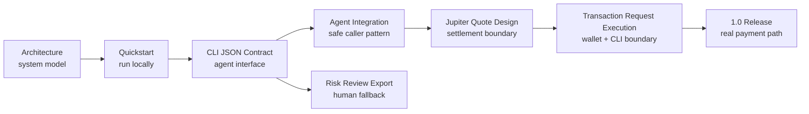

# jup.sh Docs

Risk and settlement for Solana agent payments.

`jup.sh` is a developer tool for agent-native payments on Solana.

The 1.0 npm CLI is live:

```bash
npx jup-sh
```

```txt
Agents pay with any verified token.
Recipients settle in USDC.
Policy decides when humans step in.
```

## 3-Minute Integration

The homepage shows the short entry point:

```bash
npx jup-sh init
npx jup-sh doctor
```

Then configure policy and create a payment intent:

```bash
npx jup-sh policy trust api.vendor.example
npx jup-sh pay --agent deepseek --token SOL --amount 6 --settle USDC --recipient api.vendor.example --json
```

The output is a structured local payment intent. Agents should branch on:

| Exit code | Decision | Meaning |
| --- | --- | --- |
| `0` | `auto_pay` | Inside local policy and ready for authorization or execution. |
| `2` | `review_required` | Return or open the Risk Review URL. |
| `1` | `rejected` | Stop the payment flow. |

Execution boundary:

```txt
Server transaction requests return unsigned Jupiter swap transactions for wallets.
CLI execution signs and submits only with an explicit local keypair.
No hosted custody. No server-side private keys.
```

The fastest path after this page is [Agent Integration](agent-integration.md).

## Read This First

The docs are organized around the current engineering boundary:



Recommended order:

1. [Architecture](architecture.md) - system boundary, diagrams, data model.
2. [Quickstart](quickstart.md) - run the CLI locally.
3. [CLI JSON Contract](cli-json-contract.md) - agent-facing output and exit codes.
4. [Agent Integration](agent-integration.md) - safe caller pattern for agents.
5. [Jupiter Quote-Only Design](jupiter-quote-design.md) - token-to-USDC quote boundary.
6. [Risk Review Export Design](risk-review-export-design.md) - static review URL model.
7. [Transaction Request Skeleton Design](transaction-request-skeleton-design.md) - Solana Pay wallet boundary.
8. [1.0.0](releases/1.0.0.md) - first real payment execution release.
9. [Complete Version Roadmap](complete-version-roadmap.md) - historical runtime path.
10. [SDK Technical Design](sdk-technical-design.md) - first TypeScript SDK surface.
11. [0.1.0-alpha.0](releases/0.1.0-alpha.0.md) - first local CLI checkpoint.
11. [0.1.0-alpha.1](releases/0.1.0-alpha.1.md) - SDK risk-layer checkpoint.
12. [0.1.0-alpha.2](releases/0.1.0-alpha.2.md) - npm alpha checkpoint.
13. [0.1.0-alpha.3](releases/0.1.0-alpha.3.md) - CLI init checkpoint.
14. [0.1.0-alpha.4](releases/0.1.0-alpha.4.md) - policy tuning checkpoint.
15. [0.1.0-alpha.5](releases/0.1.0-alpha.5.md) - review shortcut checkpoint.
16. [0.1.0-alpha.6](releases/0.1.0-alpha.6.md) - doctor checkpoint.
17. [0.1.0-alpha.7](releases/0.1.0-alpha.7.md) - review handoff checkpoint.
18. [Draft 0.1.0-alpha.8](releases/0.1.0-alpha.8.md) - transaction request skeleton checkpoint.
19. [Draft 0.1.0-alpha.9](releases/0.1.0-alpha.9.md) - read-only Intent API and status model checkpoint.
20. [Draft 0.1.0-alpha.10](releases/0.1.0-alpha.10.md) - persisted local review decision checkpoint.
21. [Draft 0.1.0-alpha.11](releases/0.1.0-alpha.11.md) - transaction request runtime gate checkpoint.
22. [Draft 0.1.0-alpha.12](releases/0.1.0-alpha.12.md) - transaction request preflight checkpoint.
23. [Draft 0.1.0-alpha.13](releases/0.1.0-alpha.13.md) - receipt scaffold checkpoint.
24. [Draft 0.1.0-alpha.14](releases/0.1.0-alpha.14.md) - local intent event log checkpoint.
25. [Draft 0.1.0-alpha.15](releases/0.1.0-alpha.15.md) - intent expiry and replay gate checkpoint.
26. [Draft 0.1.0-alpha.16](releases/0.1.0-alpha.16.md) - transaction request token gate checkpoint.
27. [Draft 0.1.0-alpha.17](releases/0.1.0-alpha.17.md) - wallet account binding checkpoint.
29. [Draft 0.1.0-alpha.18](releases/0.1.0-alpha.18.md) - quote freshness gate checkpoint.

## Current Version

The current published checkpoint is `v1.0.0`.

The first milestone, `v0.1.0-alpha.0`, established the source-run CLI, JSON
contract, local policy checks, Jupiter quote-only estimates, local intent
storage, and static Risk Review export.

The alpha.1 checkpoint focuses on the SDK risk layer and Risk Review
explainability. The alpha.2 checkpoint adds the first public npm alpha package.
The alpha.3 checkpoint adds the first-run `jup-sh init` workflow.
The alpha.4 checkpoint adds local policy tuning commands.
The alpha.5 checkpoint adds a top-level `jup-sh review` shortcut.
The alpha.6 checkpoint adds local workspace diagnostics with `jup-sh doctor`.
The alpha.7 checkpoint adds full review handoff metadata to `pay --json`.
The draft alpha.8 checkpoint documents the future Solana Pay transaction
request skeleton without changing the current runtime boundary.

The [Complete Version Roadmap](complete-version-roadmap.md) records the path
from the alpha checkpoints to real authorization, settlement, confirmation,
and receipt.
The draft alpha.9 checkpoint starts that runtime path with a read-only local
Intent API and lifecycle status summary.
The draft alpha.10 checkpoint adds local persisted review approvals and
rejections while still stopping before transaction generation.
The draft alpha.11 checkpoint added the transaction request endpoint shape and
runtime gates. The 1.0 release replaces that placeholder with a signable
Jupiter swap transaction.
The draft alpha.12 checkpoint makes that gate inspectable through preflight,
so agents can see why transaction construction is blocked before attempting
POST.
The draft alpha.13 checkpoint makes unavailable receipts explicit while no
confirmed settlement exists.
The draft alpha.14 checkpoint adds a local event log so review and transaction
request attempts have an audit trail before real receipts exist.
The draft alpha.15 checkpoint adds expiration metadata and blocks expired
intents from review approval or transaction request creation.
The draft alpha.16 checkpoint adds an opaque local request token to transaction
request URLs.
The draft alpha.17 checkpoint binds transaction request attempts to the first
wallet account that reaches the POST gate.
The 1.0 checkpoint adds real Jupiter swap transaction creation, local keypair
signing, RPC submission, confirmation, and receipt persistence.

It includes:

- public npm CLI;
- source-run Rust CLI for development;
- local policy checks;
- mock settlement quotes;
- optional Jupiter ExactOut settlement quotes;
- local intent storage;
- local workspace initialization with `jup-sh init`;
- local policy tuning with `policy trust`, `policy untrust`, and `policy set`;
- Risk Review URL export;
- top-level Risk Review URL shortcut with `jup-sh review`;
- local workspace diagnostics with `jup-sh doctor`;
- review handoff fields in `pay --json` and `review --json`;
- Solana Pay transaction request generation for wallet signing;
- local `intent execute` for user-keypair signing, RPC submission, and receipt
  persistence;
- hosted static Risk Review rendering;
- source-only TypeScript SDK helpers for payment intents, Jupiter quote-only
  estimates, and Risk Review URL export;
- SDK policy profiles for sandbox, balanced, and strict risk posture;
- SDK trusted-recipient helper for known API/vendor destinations;
- SDK policy decision explanations for Risk Review and agent logs;
- hosted Risk Review page policy explanations before raw policy evidence;
- an agent-facing JSON contract;
- a public `jup-sh` npm package;
- release checks for the npm package shape.

It does not include:

- custody;
- remote backend persistence;
- a published SDK package.

## Core Command

```bash
pay --agent deepseek --token SOL --amount 20 --settle USDC
```

In source-run form:

```bash
npm run cli:alpha -- pay --agent deepseek --token SOL --amount 20 --settle USDC
```

With npm:

```bash
npx jup-sh pay --agent deepseek --token SOL --amount 20 --settle USDC
```

## Product Boundary

`jup.sh` is an independent community-built tool and is not affiliated with
Jupiter.

The current integration direction is Jupiter-powered settlement and
policy-driven risk management. In 1.0, Jupiter quotes can be turned into real
swap transactions for wallet signing or local CLI execution.
