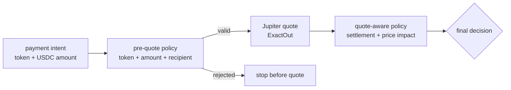

# Jupiter Quote-Only Design

Jupiter is the settlement primitive for `jup.sh`.

The payer should be able to use any verified token. The recipient should settle
in USDC. The current alpha only asks Jupiter for quote estimates; it does not
request swap transactions or execute routes.

## Settlement Goal

The command is settlement-first:

```bash
jup-sh pay --agent deepseek --token SOL --amount 20 --settle USDC
```

This means:

- payer token: `SOL`;
- recipient settlement target: `20 USDC`;
- policy should evaluate whether this payment can continue.

With Jupiter enabled:

```bash
jup-sh pay \
  --agent deepseek \
  --token SOL \
  --amount 20 \
  --settle USDC \
  --quote-provider jupiter
```

## Quote Flow



The quote is not just display data. It becomes policy evidence.

## Why ExactOut

`jup.sh` promises recipient settlement in USDC. The important amount is the
recipient amount, not the payer input amount.

For that reason, the alpha uses Jupiter quote mode equivalent to:

```txt
swapMode=ExactOut
```

Request shape:

```txt
GET https://api.jup.ag/swap/v1/quote
  ?inputMint=<payer token mint>
  &outputMint=<USDC mint>
  &amount=<USDC raw amount>
  &slippageBps=50
  &swapMode=ExactOut
```

If configured, `JUPITER_API_KEY` is sent as `x-api-key`.

CLI options:

```bash
--quote-provider jupiter
--jupiter-api-key <key>
--jupiter-quote-url <url>
--slippage-bps 50
```

## Quote Provider Boundary

The Rust core owns the quote abstraction:

```rust
pub trait SettlementQuoter {
    fn quote_settlement(
        &self,
        input: &CreatePaymentIntentInput,
    ) -> Result<SettlementQuote, JupShError>;
}
```

Implemented providers:

| Provider | Source | Purpose |
| --- | --- | --- |
| `mock` | `MockSettlementQuoter` | Stable local tests and development. |
| `jupiter` | `JupiterSettlementQuoter` | Real quote estimate without execution. |

The policy engine depends on the quote shape, not on a specific HTTP client.
That keeps local tests deterministic and makes Jupiter optional in the alpha.

## Token Map

The first implementation uses a deliberately small token map:

| Symbol | Mint | Decimals |
| --- | --- | --- |
| SOL | `So11111111111111111111111111111111111111112` | 9 |
| USDC | `EPjFWdd5AufqSSqeM2qN1xzybapC8G4wEGGkZwyTDt1v` | 6 |
| JUP | `JUPyiwrYJFskUPiHa7hkeR8VUtAeFoSYbKedZNsDvCN` | 6 |
| BONK | `DezXAZ8z7PnrnRJjz3my2u6r5KiL3HR8APpPB2634B2` | 5 |

Future versions should replace this with a verified token registry. The token
registry should be a risk input, not only a UX convenience.

## Returned Quote

The quote is embedded inside `PaymentIntent.quote`:

```json
{
  "source": "jupiter_swap_exact_out",
  "inputToken": "SOL",
  "inputAmount": 0.225525465,
  "settleAmount": 20,
  "settleToken": "USDC",
  "priceImpactBps": 0
}
```

The quote preserves the product language:

- input token: what the payer would spend;
- settlement amount: what the recipient should receive;
- settlement token: USDC;
- price impact: risk evidence.

## Quote-Aware Policy

After a quote is available, the core appends quote-aware checks:

| Check | Meaning |
| --- | --- |
| `quote_available` | The provider returned a usable quote. |
| `quote_settlement_token` | The quote settles to the requested settlement token. |
| `quote_price_impact` | Price impact is inside policy or requires review. |

Default policy:

```json
{
  "maxPriceImpactBps": 100,
  "reviewHighPriceImpact": true
}
```

If `priceImpactBps` exceeds `maxPriceImpactBps`, the intent becomes
`review_required` unless high price impact review is disabled.

## Failure Behavior

The current alpha treats quote failure as a command failure for Jupiter mode.
That is conservative: if route data is unavailable, the CLI should not pretend
the payment is ready.

Later versions may support a policy option such as:

```json
{
  "reviewWhenQuoteUnavailable": true
}
```

That would convert route failure into `review_required` instead of a hard
command failure.

## Non-Goals

This phase does not:

- sign transactions;
- execute swaps;
- request Jupiter swap transaction payloads;
- create Solana Pay transaction requests;
- custody funds;
- support arbitrary token discovery;
- replace the default mock provider.

## Next Steps

1. Add route quality checks beyond price impact.
2. Store route metadata for Risk Review.
3. Add a verified token registry.
4. Generate Solana Pay transaction requests after quote behavior is stable.
5. Keep Jupiter route construction behind the same `SettlementQuoter` boundary.
