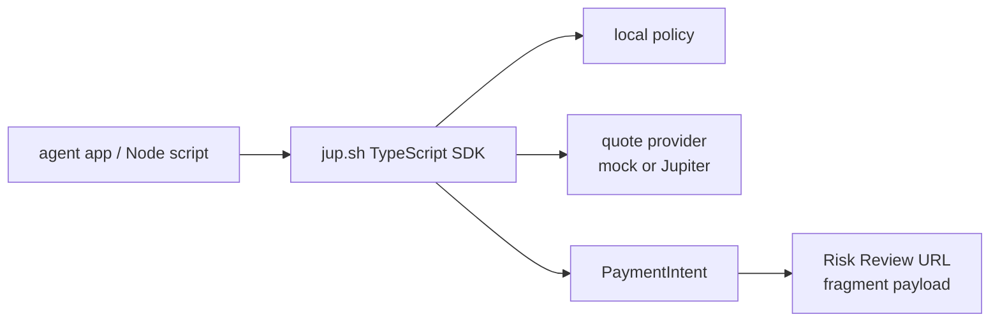
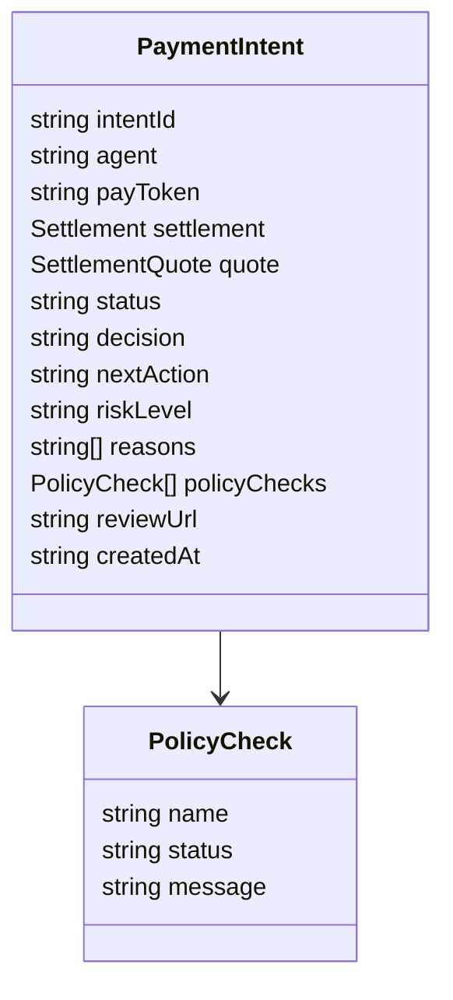
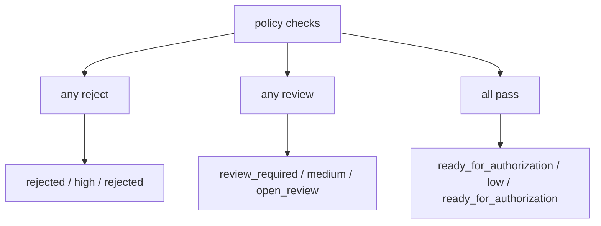

# SDK Technical Design

The SDK is the next interface after the CLI.

The CLI proves that an agent payment intent can be created from a command. The
SDK should make the same primitive usable from application code without
requiring a subprocess.

## Goal

The first SDK surface should feel like this:

```ts
import { createPaymentIntent } from "./sdk/index.js";

const intent = await createPaymentIntent({
  agent: "deepseek",
  token: "SOL",
  amount: 20,
  settle: "USDC",
});
```

The result should match the CLI JSON contract:

```txt
PaymentIntent + policyChecks + quote + decision + nextAction
```

The SDK does not sign transactions, execute swaps, custody funds, or call a
hosted backend in this phase.

## SDK Boundary



The first SDK is local and deterministic. It mirrors the CLI contract so that
apps can integrate before a backend exists.

## Public API

### createPaymentIntent

```ts
createPaymentIntent(input, options?): Promise<PaymentIntent>
```

Input:

```ts
type CreatePaymentIntentInput = {
  agent: string;
  token: string;
  amount: number;
  settle: "USDC" | string;
  recipient?: string;
  reference?: string;
};
```

Options:

```ts
type CreatePaymentIntentOptions = {
  policy?: Partial<Policy>;
  quoteProvider?: SettlementQuoter;
  reviewBaseUrl?: string;
  now?: () => Date;
  idFactory?: () => string;
};
```

The default quote provider is a mock provider. Jupiter-backed quotes should be
available behind the same `SettlementQuoter` boundary.

### Policy Profiles

```ts
getPolicyProfile(name): Policy
POLICY_PROFILES
sandboxPolicy
balancedPolicy
strictPolicy
```

The SDK includes three local policy profiles:

| Profile | Use case | Behavior |
| --- | --- | --- |
| `sandbox` | Agent demos, hackathons, and local testing | Larger auto-pay window, unknown recipients do not require review. |
| `balanced` | Known agents paying known APIs | Small auto-pay limit, unknown recipients and larger amounts require review. |
| `strict` | New agents, unknown recipients, or higher-risk environments | Lower limits and tighter quote price-impact checks. |

Example:

```ts
import {
  createPaymentIntent,
  getPolicyProfile,
} from "./sdk/index.js";

const intent = await createPaymentIntent(
  {
    agent: "deepseek",
    token: "SOL",
    amount: 20,
    settle: "USDC",
  },
  {
    policy: getPolicyProfile("strict"),
  }
);
```

`DEFAULT_POLICY` is the `balanced` profile. This keeps existing behavior
conservative while giving developers a clearer product-level entry point than
hand-writing every policy field.

### Trusted Recipients

```ts
withTrustedRecipients(policy, recipients): Policy
```

Trusted recipients let a local policy distinguish a known API/vendor from an
unknown destination:

```ts
import {
  createPaymentIntent,
  getPolicyProfile,
  withTrustedRecipients,
} from "./sdk/index.js";

const policy = withTrustedRecipients(getPolicyProfile("balanced"), [
  "api.vendor.example",
]);

const intent = await createPaymentIntent(
  {
    agent: "deepseek",
    token: "SOL",
    amount: 2,
    settle: "USDC",
    recipient: "api.vendor.example",
  },
  { policy }
);
```

For small payments, a trusted recipient can keep the flow inside policy. An
unknown recipient still triggers Risk Review under the `balanced` and `strict`
profiles.

### Policy Explainability

```ts
explainPolicyDecision(intent): PolicyDecisionExplanation
```

The SDK can turn raw policy checks into a compact explanation object:

```ts
import {
  createPaymentIntent,
  explainPolicyDecision,
  getPolicyProfile,
} from "./sdk/index.js";

const intent = await createPaymentIntent(
  {
    agent: "deepseek",
    token: "SOL",
    amount: 20,
    settle: "USDC",
  },
  {
    policy: getPolicyProfile("balanced"),
  }
);

const explanation = explainPolicyDecision(intent);
```

Output shape:

```ts
type PolicyDecisionExplanation = {
  summary: string;
  riskFactors: string[];
  passedChecks: string[];
  rejectedChecks: string[];
  recommendedAction: string;
  reviewUrl: string | null;
};
```

Example summary:

```txt
Risk Review required because recipient is unknown and amount exceeds the auto-pay limit.
```

The helper does not re-run policy or change the decision. It only makes the
existing `policyChecks` easier to show in logs, agent responses, or Risk Review.

### createJupiterQuoteProvider

```ts
createJupiterQuoteProvider(options?): SettlementQuoter
```

The Jupiter provider uses quote-only `ExactOut` mode to estimate the payer token
amount required to settle the requested USDC amount. It does not request swap
transactions or execute routes.

```ts
const intent = await createPaymentIntent(
  {
    agent: "deepseek",
    token: "SOL",
    amount: 20,
    settle: "USDC",
  },
  {
    quoteProvider: createJupiterQuoteProvider(),
  }
);
```

### evaluatePolicy

```ts
evaluatePolicy(input, policy): PolicyResult
```

This exposes the deterministic policy engine for tests and custom integrations.

### createMockSettlementQuote

```ts
createMockSettlementQuote(input): SettlementQuote
```

This keeps local examples stable and avoids external dependencies.

### Risk Review Helpers

```ts
createRiskReviewUrl(intent, options?): string
encodeRiskReviewPayload(intent): string
parseRiskReviewPayload(payload): PaymentIntent
```

These helpers mirror the CLI `intent export` format:

```txt
https://jup.sh/pay/<intent_id>#intent=<base64url-json-payload>
```

The payload is:

```txt
base64url(JSON.stringify(PaymentIntent))
```

Example:

```ts
import {
  createPaymentIntent,
  createRiskReviewUrl,
} from "./sdk/index.js";

const intent = await createPaymentIntent({
  agent: "deepseek",
  token: "SOL",
  amount: 20,
  settle: "USDC",
});

if (intent.nextAction === "open_review") {
  const reviewUrl = createRiskReviewUrl(intent, {
    reviewBaseUrl: "https://www.jup.sh",
  });
  console.log(reviewUrl);
}
```

The generated URL can be opened by the current static Risk Review page. The
helper does not upload data to a server.

## Data Contract

The SDK should reuse the same field names as the CLI JSON contract.



This is intentional. The SDK should not invent a second contract that differs
from the CLI.

## Decision Mapping



The mapping must remain aligned with the CLI:

| Decision | Status | Next action | Risk level |
| --- | --- | --- | --- |
| `auto_pay` | `ready_for_authorization` | `ready_for_authorization` | `low` |
| `review_required` | `review_required` | `open_review` | `medium` |
| `rejected` | `rejected` | `rejected` | `high` |

## Current Phase

The first SDK implementation should include:

- TypeScript types;
- default policy;
- named policy profiles;
- local deterministic policy checks;
- policy decision explanations;
- mock settlement quote;
- Jupiter quote-only provider;
- Risk Review URL export helpers;
- `createPaymentIntent`;
- Node examples;
- typecheck in the release gate.

It should not include:

- npm publishing;
- bundled build output;
- wallet signing;
- Solana transaction requests;
- hosted backend API calls.

## Future Phase

Once the local SDK surface is stable:

1. Decide whether npm package export should include CLI, SDK, or separate
   packages.
2. Add transaction request creation only after policy and quote behavior are
   stable.
